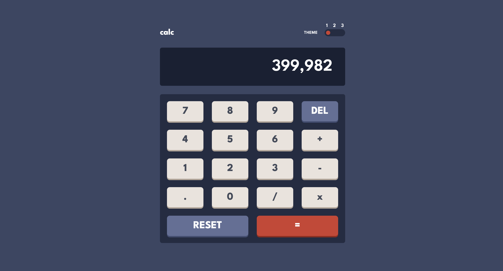
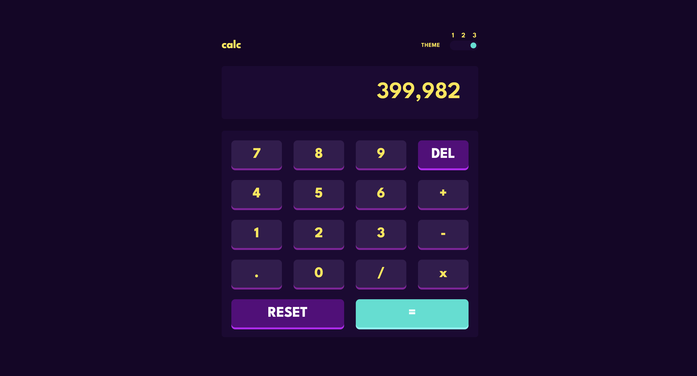

# React Calculator app with TypeScript and Tailwind

## Example Solution for Calculator app Challenge on Frontend Mentor

### [Link to the Challenge](https://www.frontendmentor.io/challenges/calculator-app-9lteq5N29)






## Try This App! 👼

### 1. Clone the Project

1. **Install Git**: Download from [git-scm.com](https://git-scm.com/).
2. **Open VS Code**.
3. **Clone Repository**:
   - Go to `View` -> `Command Palette` or press `Ctrl+Shift+P`.
   - Type `Git: Clone` and select `Git: Clone`.
   - Enter the repository URL (`https://github.com/Sachintha-Lakruwan/FAQ-accordion.git`) and click `Clone`.
   - Choose a local directory to save the repository.
   - Open the cloned repository when prompted.

### 2. Install npm Packages

1. **Install Node.js**: Download from [nodejs.org](https://nodejs.org/).
2. **Install npm Packages**:
   ```sh
   npm install
   ```

### 3. Run the Project

1. **Start the Development Server**:
   ```sh
   npm run dev
   ```
2. **Open in Browser**: Navigate to `http://localhost:5173/` (or specified port).
