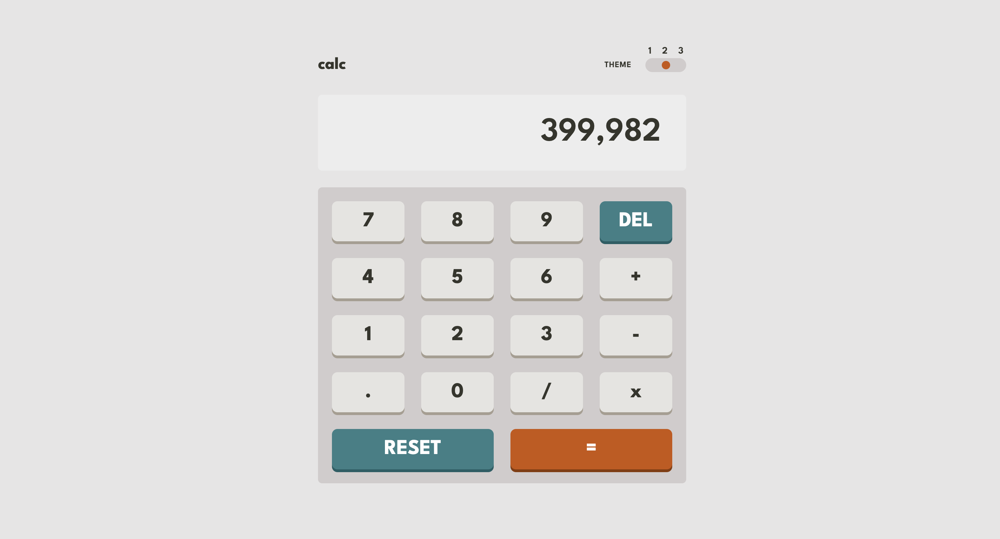

# React Calculator app with TypeScript, Redux and Tailwind

## Example Solution for Calculator app Challenge on Frontend Mentor

### [Live-Demo 🚀](https://calc199.netlify.app/)

### [Challenge Link](https://www.frontendmentor.io/challenges/calculator-app-9lteq5N29)





In this challenge, there were two main tasks:

1. Implementing themes
2. Calculator functionality

I used Tailwind to style this app. It's not too hard to use different themes in Tailwind. I followed the article below to do so. Credits to the owner! 🥂

[Link to the article](https://dev.to/ultroneoustech/creating-multiple-themes-in-tailwind-css-and-nextjs-2e98)

However, one thing didn't quite work for me. In the article, he used the following approach to import themes:

```css
@layer base {
  html {
    --background-main: hsl(222, 26%, 31%);
    --background-keypad: hsl(223, 31%, 20%);
    --background-screen: hsl(224, 36%, 15%);
  }
  @import "themes/theme1.css";
}
```

But for me, it didn't work 🤷‍♂️. After tweaking around a bit, I found the following method worked correctly:

```css
@layer base {
  html {
    --background-main: hsl(222, 26%, 31%);
    --background-keypad: hsl(223, 31%, 20%);
    --background-screen: hsl(224, 36%, 15%);
  }
  html[data-theme="theme1"] {
    --background-main: hsl(222, 26%, 31%);
    --background-keypad: hsl(223, 31%, 20%);
    --background-screen: hsl(224, 36%, 15%);
  }
}
```

Instead of importing from an external file, I placed the themes in the index.css file. I'm not exactly sure why the first method didn't work for me, but if I figure it out, I'll leave a note here ✊. And that's how I implemented the themes.

When it came to adding functionality, I decided to go with Redux Toolkit. The main reason for that? I wanted to refresh my memory of Redux 😅. But it was worth it because it allowed me to separate all the logical parts into one file (calculatorSlice.ts). However, using Redux with TypeScript requires extra steps to configure the store, etc., but it's worth it.

I finished the logical part and fixed most of the edge cases. Actually, fixing edge cases was the biggest task 😅. Let me give you an example of an edge case:

```sh
23 + 034
```

If there's an input like the one above, with leading zeros, the expression will not be correctly evaluated with the `eval()` function. So, I had to catch such cases and remove those leading zeros. There were many edge cases to solve.

That's pretty much it about this app. See you in another project! 👋

## Try This App Locally! 👼

### 1. Clone the Project

1. **Install Git**: Download from [git-scm.com](https://git-scm.com/).
2. **Open VS Code**.
3. **Clone Repository**:
   - Go to `View` -> `Command Palette` or press `Ctrl+Shift+P`.
   - Type `Git: Clone` and select `Git: Clone`.
   - Enter the repository URL (`https://github.com/Sachintha-Lakruwan/FAQ-accordion.git`) and click `Clone`.
   - Choose a local directory to save the repository.
   - Open the cloned repository when prompted.

### 2. Install npm Packages

1. **Install Node.js**: Download from [nodejs.org](https://nodejs.org/).
2. **Install npm Packages**:
   ```sh
   npm install
   ```

### 3. Run the Project

1. **Start the Development Server**:
   ```sh
   npm run dev
   ```
2. **Open in Browser**: Navigate to `http://localhost:5173/` (or specified port).
